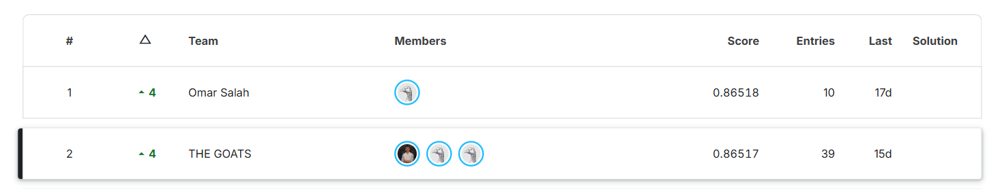

# Kaggle Tabular Classification Project

## 📌 Project Overview

This project solves a **binary classification problem** on an anonymized tabular dataset from a Kaggle competition.

The dataset contains ten numerical features with anonymized names (`f01`–`f10`) and a binary target. Since the real meaning of the features is not provided, the project focuses on the **machine learning workflow and predictive performance** rather than domain-specific interpretation.

The project covers the full workflow: exploratory data analysis, preprocessing, model comparison, hyperparameter tuning, cross-validation, feature importance analysis, and Kaggle submission.

The final CatBoost submission scored **0.86517 ROC-AUC on the Kaggle leaderboard and ranked 2nd** 🥈.



---

## 🎯 Objective

Build a classification model that separates the two target classes and produces **probability predictions** for unseen test data.

The evaluation metric is **ROC-AUC**, so the models are compared and submitted using predicted probabilities of the positive class (`predict_proba`), not hard class labels.

---

## 📊 Dataset

| Dataset  |          Shape | Description                   |
| -------- | -------------: | ----------------------------- |
| Training | `(103,217, 12)` | 10 features + `id` + `target` |
| Test     |  `(44,236, 11)` | 10 features + `id`            |

### Features

```text
f01, f02, f03, f04, f05,
f06, f07, f08, f09, f10
```

The `id` column is only an identifier and was dropped before training.

> **Note:** Feature names are anonymized, so feature importance is interpreted only in terms of predictive contribution.

---

## 🔎 Exploratory Data Analysis

The EDA in the notebook included:

- Dataset shape, data types, and `df.info()`
- Summary statistics (`df.describe()`)
- Missing-value analysis
- Duplicate check (**0 duplicate rows** found)
- Feature distributions (histograms)
- Correlation heatmap

### Missing Values

Only two features contain missing values, in both the training and test sets:

| Feature | Missing in Train | Missing in Test |
| ------- | ---------------: | --------------: |
| `f04`   |           20,118 |           8,735 |
| `f06`   |            2,634 |           1,139 |

Both were filled with **median imputation** (each dataset using its own median). The median was chosen because the features are heavily skewed with extreme outliers (for example, `f04` ranges down to about -618,904 and `f09` to about -694,787).

---

## ⚖️ Target Distribution

The target is imbalanced: the positive class is about **6.69%** of the training data (5,524 positives vs. 77,049 negatives in the training fold).

Because of this, accuracy would be misleading, so **ROC-AUC** is used as the main metric.

---

## ⚙️ Data Preprocessing

1. Load the training and test sets.
2. Inspect structure, data types, and missing values.
3. Fill missing `f04` and `f06` values with the median.
4. Drop the `id` column and separate features (`X`) from the target (`y`).
5. Split into training and validation sets with a **stratified** split:

```python
train_test_split(X, y, test_size=0.2, random_state=42, stratify=y)
```

6. Apply **`RobustScaler`** (chosen for its resistance to outliers) for the Logistic Regression baseline and the cross-validation experiment. The tree-based models were trained on the unscaled features, since tree models are not sensitive to feature scale.

---

## 🤖 Models

### Baseline

- Logistic Regression (`max_iter=250`, on `RobustScaler`-scaled data)

### Ensemble & Boosting Models

- Random Forest
- XGBoost
- LightGBM
- CatBoost
- Gradient Boosting
- HistGradientBoosting

### Hyperparameter Tuning

`GridSearchCV` (3-fold, `scoring='roc_auc'`) was used to search the parameter space for **XGBoost, LightGBM, and CatBoost**. The final values below were then refined manually around the grid-search results.

| Model                | Final Hyperparameters                                                                                                   |
| -------------------- | ----------------------------------------------------------------------------------------------------------------------- |
| Random Forest        | `n_estimators=700, max_depth=15, min_samples_split=15, min_samples_leaf=10, max_features="sqrt"`                        |
| XGBoost              | `n_estimators=200, max_depth=5, learning_rate=0.045, subsample=0.8, colsample_bytree=1.0`                               |
| LightGBM             | `n_estimators=390, num_leaves=20, learning_rate=0.01, max_depth=-1, subsample=0.8, colsample_bytree=0.8`               |
| **CatBoost**         | `iterations=380, depth=7, learning_rate=0.04, l2_leaf_reg=5, subsample=0.8`                                             |
| Gradient Boosting    | `n_estimators=300, max_depth=5, learning_rate=0.05, subsample=0.9, min_samples_leaf=10`                                 |
| HistGradientBoosting | `max_iter=250, max_depth=5, max_leaf_nodes=7, learning_rate=0.05, min_samples_leaf=50, l2_regularization=5`             |

---

## 📈 Model Performance

All models were evaluated using **Validation ROC-AUC**.

| Model                | Validation ROC-AUC |
| -------------------- | -----------------: |
| Logistic Regression  |            0.69232 |
| **Random Forest**    |        **0.86631** |
| **CatBoost** (final) |        **0.86595** |
| LightGBM             |            0.86526 |
| XGBoost              |            0.86508 |
| HistGradientBoosting |            0.86467 |
| Gradient Boosting    |            0.86367 |

### Cross-Validation (LightGBM, 5-fold Stratified)

To check that results are stable and not tied to a single split, LightGBM was evaluated with `StratifiedKFold(n_splits=5, shuffle=True, random_state=42)`:

| Fold | ROC-AUC |
| ---- | ------: |
| 1    | 0.86524 |
| 2    | 0.86864 |
| 3    | 0.86041 |
| 4    | 0.85925 |
| 5    | 0.86060 |
| **Mean** | **0.86283** |

### Takeaways

- Moving from the linear baseline (**0.692**) to tree-based ensembles (**~0.864–0.866**) gives a large jump, which suggests the features relate to the target in a strongly nonlinear way.
- The top boosting and ensemble models are extremely close (within about 0.001 ROC-AUC), and fold-to-fold variation in cross-validation (about ±0.005) is larger than that gap. So the ranking among them should be read as "roughly equivalent" rather than a clear winner.

---

## 🏆 Final Model

**CatBoost** was used for the final Kaggle submission (validation ROC-AUC **0.86595**, within 0.0004 of the best validation score from Random Forest at 0.86631).

Final predictions are probabilities of the positive class, saved to:

```text
Cat_Submission.csv
```

The trained model is also saved with `joblib` (`Best_Model.pkl`) for future use.

---

## 🥇 Kaggle Result

| Metric                     |     Score |
| -------------------------- | --------: |
| Local validation ROC-AUC   |   0.86595 |
| **Kaggle leaderboard ROC-AUC** | **0.86517** |
| **Leaderboard rank**       | **2nd 🥈** |

The gap between the local validation score and the Kaggle score is only about **0.0008**, which indicates the validation setup is reliable and the model generalizes well to unseen data.


---

## 🔍 Feature Importance

Feature importance was analyzed with **Random Forest** and cross-checked with **XGBoost**.

| Feature | Random Forest | XGBoost |
| ------- | ------------: | ------: |
| `f10`   |         0.249 |   0.394 |
| `f09`   |         0.203 |   0.195 |
| `f01`   |         0.125 |   0.108 |
| `f03`   |         0.107 |   0.156 |
| `f02`   |         0.080 |   0.022 |
| `f04`   |         0.071 |   0.021 |
| `f05`   |         0.070 |   0.024 |
| `f07`   |         0.053 |   0.023 |
| `f06`   |         0.022 |   0.021 |
| `f08`   |         0.021 |   0.036 |

Both models agree that **`f10`, `f09`, `f01`, and `f03`** are the strongest contributors, while `f06` is consistently among the weakest.

As the features are anonymized, these results describe predictive contribution only, without assigning real-world meaning.

---

## 🧠 Key Machine Learning Concepts Demonstrated

- Exploratory Data Analysis
- Missing-value handling (median imputation)
- Feature scaling with `RobustScaler`
- Class imbalance analysis
- Stratified train/validation splitting
- Stratified K-Fold cross-validation
- Binary classification with a Logistic Regression baseline
- Random Forest, Gradient Boosting, XGBoost, LightGBM, CatBoost, HistGradientBoosting
- Hyperparameter tuning with `GridSearchCV`
- Probability-based predictions
- ROC-AUC evaluation
- Feature importance analysis
- Model persistence with `joblib`
- Kaggle submission workflow

---

## 🔭 Limitations & Future Improvements

- **Train on all data:** the final model was trained on about 80% of the training data. Retraining on the full training set before predicting could give a small gain.
- **Imputation inside the split:** median imputation was applied before the train/validation split. Fitting the imputer on the training fold only (for example inside a `Pipeline`) would be cleaner.
- **Ensembling:** the top models score very similarly, so blending or stacking CatBoost, LightGBM, XGBoost, and Random Forest is a natural next step.
- **Feature engineering:** with only ten features, missing-value indicators for `f04` and `f06` and interactions between the top features (`f10`, `f09`, `f01`, `f03`) are worth testing.
- **Class imbalance:** try class weights or `scale_pos_weight` and compare against the current probability-based approach.

---

## 🛠️ Technologies

- **Python**
- **Pandas**, **NumPy**
- **Matplotlib**, **Seaborn**
- **Scikit-learn**
- **XGBoost**, **LightGBM**, **CatBoost**
- **Joblib**
- **Jupyter Notebook**

---

## 📁 Project Structure

```text
Kaggle-Classification-Project/
│
├── Classification_Project.ipynb
├── Cat_Submission.csv
├── Kaggle_Leaderboard.png
├── README.md
├── requirements.txt
└── .gitignore
```

---

## 🚀 How to Run

### 1. Clone the repository

```bash
git clone <repository-url>
cd Kaggle-Classification-Project
```

### 2. Install dependencies

```bash
pip install -r requirements.txt
```

### 3. Add the competition data

Download `train.csv` and `test.csv` from the Kaggle competition page and place them next to the notebook.

### 4. Open the notebook

```text
Classification_Project.ipynb
```

Run the cells sequentially to reproduce the analysis, model training, and submission file.

---

## 📌 Key Takeaways

Starting from a **Logistic Regression baseline (0.692)**, several ensemble and boosting models were compared, and the best of them reach about **0.866 validation ROC-AUC**. **CatBoost** was used for the final submission and achieved:

> **0.86517 ROC-AUC on Kaggle — 2nd place on the leaderboard** 🥈

The project highlights the value of a strong baseline, an appropriate metric for an imbalanced target, cross-validation, and checking that local validation scores match the score on unseen data.

---

## 👤 Author

**Ahmed Abdelfattah**

Aspiring **Applied AI / LLM Engineer**

Currently building practical experience across:

- Machine Learning
- Deep Learning
- NLP
- LLMs
- Applied AI
